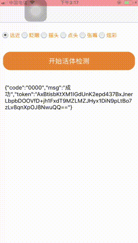

网关接入参考SDK
---
### 概述
鸿蒙Next 活体检测 (眨眼，摇头，点头，张嘴，远近，炫彩)，前后端结合，确保活体检测结果安全可靠。(***可用于人脸活体检测,实人认证，刷脸认证，意愿核验等场景 ***)




- H5 体验DEMO链接 ： https://dev.esandcloud.com/h5demo/esand/living

### 接入步骤
1. 开通响应的服务 (阿里云接入需要，一砂云接入只需要联系客服开通即可)
   a. 活体检测开通地址：https://market.aliyun.com/apimarket/detail/cmapi00046021?spm=5176.shop.result.30.6b7c28d8OLjEwj
   b. 刷脸认证开通地址：https://market.aliyun.com/apimarket/detail/cmapi00047625?spm=5176.shop.result.62.6b7c28d8OLjEwj
   c. 实名认证开通地址：https://market.aliyun.com/apimarket/detail/cmapi00046546?spm=5176.shop.result.18.6b7c28d8OLjEwj
   d. 意愿核验：https://market.aliyun.com/apimarket/detail/cmapi00067166?spm=5176.shop.result.74.6b7c28d8OLjEwj
2. 获取并替换APPCODE (在 src/main/ets/common/utils/LdtHttpRequest 文件中的 MY_APPCODE)
3. 编译并运行

### 参考文档
- 接入参考文档, 如下（按功能分）：
    - 活体检测：https://esandinfo.yuque.com/yv6e1k/aa4qsg/axsfon
    - 刷脸认证：https://esandinfo.yuque.com/yv6e1k/aa4qsg/upsda2
    - 实名认证：https://esandinfo.yuque.com/yv6e1k/aa4qsg/em6c1a
    - 实名认证-审核版本 : https://esandinfo.yuque.com/yv6e1k/aa4qsg/wpmzgu4qgn81zvob
    - 港澳公民实名认证：https://esandinfo.yuque.com/yv6e1k/aa4qsg/wmopntp36utpc1l0
    - 意愿核验：https://esandinfo.yuque.com/yv6e1k/aa4qsg/kt2u2srkt7wkh9qb

### Q&A

### 联系我
有任何问题或疑问可联系我
```
瑞德

微信：esand_info
qq: 3626921591
电话：13691664797
邮箱：reid.li@foxmail.com
```

扫我加微信：


